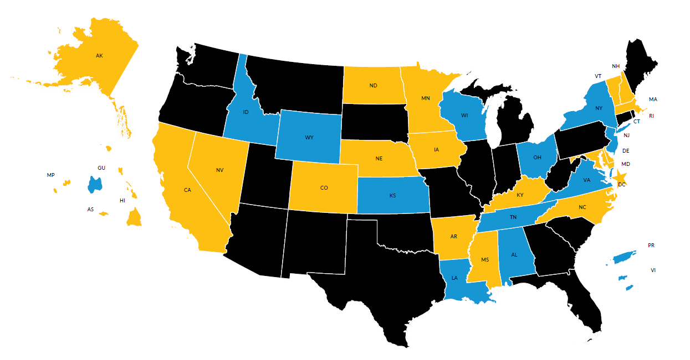

---
output:
  revealjs::revealjs_presentation:
    css: www/revealjs.css
    incremental: TRUE
    reveal_options:
      slideNumber: TRUE
      previewLinks: TRUE
editor_options:
  chunk_output_type: console
---

```{r setup, echo = FALSE, warning = FALSE, message = FALSE}
library(knitr)
library(tidyverse)
library(urbnmapr)
library(urbnthemes)

# opts_chunk$set(echo = FALSE)
opts_chunk$set(message = FALSE)
opts_chunk$set(warning = FALSE)
```

# <font color="#ffffff"> urbnmapr </font> {data-background=#1696d2}


## A simple solution to a common problem

urbnmapr makes a few variations of the same basic map.

<div id="left">

```{r state1, echo = FALSE}

ggplot() +
  geom_sf(get_urbn_map("states", sf = TRUE),
          mapping = aes(),
          fill = "grey", color = "white") +
  coord_sf(datum = NA) +
  urbnthemes::theme_urbn_map()

```

</div>

<div id="right">

```{r county1, echo = FALSE}

ggplot() +
  geom_sf(get_urbn_map("counties", sf = TRUE),
          mapping = aes(),
          fill = "grey", color = "white") +
   geom_sf(get_urbn_map("states", sf = TRUE),
          mapping = aes(),
          fill = NA, color = "white",
          size = 0.25) +
  coord_sf(datum = NA) +
  urbnthemes::theme_urbn_map()

```

</div>

# <font color="#ffffff"> How it works </font> {data-background=#1696d2}

## Installation

The package lives on GitHub. The `devtools` package makes it easy to install straight from the source.

```{r install, eval = FALSE}

devtools::install_github("UrbanInstitute/urbnmapr")

```

## Functionality

```{r load}

states <- get_urbn_map(map = "states", sf = TRUE)

```

```{r see-states, echo = FALSE}

states %>% 
  as.data.frame() %>% 
  arrange(state_name) %>% 
  head(5)

```

You can merge your data onto this dataframe to make choropleth maps.

```{r merge}

geographic_data <- left_join(states, statedata, 
                             by = "state_name")

```

## Making maps

```{r example-map, out.height="70%", fig.height=4}

ggplot() +
  geom_sf(data = geographic_data,
          mapping = aes(fill = medhhincome),
          color = "white") +
  scale_fill_gradientn(labels = scales::dollar) +
  coord_sf(datum = NA) +
  urbnthemes::theme_urbn_map() +
  labs(fill = "Median household income")

```

## Extensions

<div id = "left">
Mapping individual states

```{r ind-state, echo = FALSE}

get_urbn_map(map = "counties", sf = TRUE) %>% 
  filter(state_abbv == "TX") %>% 
  mutate(random_var = 1:nrow(.)) %>% 
  ggplot() +
  geom_sf(mapping = aes(fill = random_var),
          color = "white",
          show.legend = FALSE) +
  scale_fill_gradientn() +
  coord_sf(datum = NA) +
  theme_urbn_map()

```

</div>

<div id = "right">

Custom layouts for specific projects

```{r ccdf, echo = FALSE, out.width = "120%"}



```

</div>

## For more information

Visit the [urbnmapr GitHub page](https://github.com/UrbanInstitute/urbnmapr) for more detailed instructions.

The Urban Institute mapping guide is currently in progress!

# <font color="#ffffff"> Why R? </font> {data-background=#1696d2}

## Why R?

* Reproducibility

* Make the same map 100 times

* It's free

* Geospatial analysis in R is constantly evolving

# <font color="#ffffff"> Why a package? </font> {data-background=#1696d2}

## Why a package?

* Portable

* Lowers the barrier to entry

* Push updates when we need to

* Cool hex stickers

# <font color="#ffffff"> R @ Urban </font> {data-background=#1696d2}

## R @ Urban

We create tools to help researchers do their jobs more efficiently- whether it is running trainings, building packages, or writing detailed guides.

You can follow along:

* Check out our [website](https://ui-research.github.io/r-at-urban/)
* Sign up for the [urbnverse list serve](https://app.smartsheet.com/b/form/9029a0a8254e4044a52cdebaebe343bf) (we won't email you more than once a month!)
* Look for new posts on [Data@Urban](https://medium.com/@urban_institute), the Urban Institute's behind-the-scenes blog on data, code, and more.
* Email me at [sstrochak@urban.org](sstrochak@urban.org) for more information!


